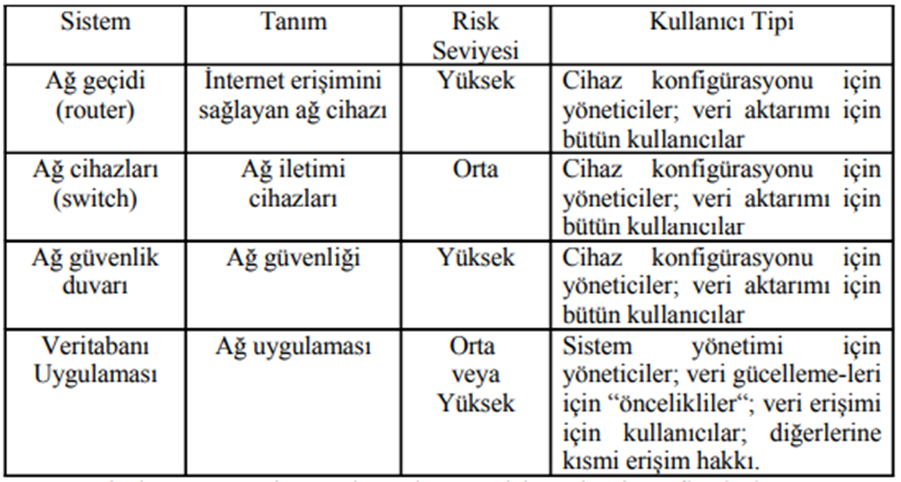

# Ağ Güvenliği Politikalarının Oluluşturulması Ve Uygulanması için Temel Adımımlar

### 1. Kurumun İhtiyaçlarının Belirlenmesi

Güvenlik Politikalarının oluşturulması sırasındaki ilk adım olarak bu politikanın kurumun hangi gereksinimlerine yönelik oluşturulacağı belirlenmelidir. Politikanın oluşması için aşağıdaki aşamalar yerine getirilmelidir:

- Korunacak nesnelerin belirlenmesi.
- Kime karşı korumanın yapılacağının belirlenmesi.
- Bilgileri saklama yönteminin belirlenmesi.
- Bilgilerin arşivlenmesi ve yedeklenmesi.
- Kurum içerisinde sorumlulukların belirlenmesi.
- Yaptırım gücünün belirlenmesi.

### 2. Risk Analizi Ve Güvenlik Matrislerinin Oluşturulması

Risk analiziyle kurumun ağına, ağ kaynaklarına ve verilere yapılabilecek saldırılarla oluşabilecek riskler tanımlanır. Amaç değişik ağ bölümlerindeki tehdit tahminlerinin belirlenmesi ve buna uygun bir düzeyde güvenlik önlemlerinin uygulanmasıdır.

Oluşabilecek tehdidin önemine ve büyüklüğüne göre üç düzey kullanılabilir; Düşük Risk, Orta Risk, Yüksek Risk.

Riskler tanımlandıktan sonra sistemin kullanıcıları tanımlanmalıdır. Kullanıcı türleri aşağıdaki gibi sınıflandırılabilir:

- Yöneticiler: Ağ kaynaklarını yönetme sorumluluğundaki iç kullanıcılar.
- Öncelikliler (priviliged): Kullanıcılardan daha fazla erişim hakkına gereksinim duyan iç kullanıcılar.
- Kullanıcılar: Genel erişim hakkına sahip iç kullanıcılar.
- İş Ortakları: Bazı kaynaklara erişim gereksinimi duyacak dış kullanıcılar.
- Diğer: Dış kullanıcılar veya müşteriler.

### 3. Yasal ve Düzenleyici Uyumluluk

- İlgili yasal düzenlemelere ve endüstri standartlarına uyum sağlama.
- Veri koruma yasalarına, gizlilik yönergelerine ve benzeri düzenlemelere uygunluk.

### 4. Stakeholder İletişimi

- İlgili taraflar (stakeholder) ile iletişim kurma ve onların görüşlerini alma.
- İş birimleri, IT ekibi, yasal departman ve üst yönetim arasında işbirliğini sağlama.

### 5. Politika Oluşturma

- Ağ güvenliği politikalarını belirleme ve yazma.
- Erişim kontrolü, veri güvenliği, şifre yönetimi, güvenlik duvarları ve benzeri konuları içeren detaylı politika belgeleri oluşturma.

### 6. Eğitim ve Farkındalık

- Organizasyon içindeki personeli ağ güvenliği politikaları konusunda eğitme.
- Farkındalık yaratma ve çalışanların güvenlik konusundaki sorumluluklarını anlamalarını sağlama.

### 7. Politika Kabul ve Onay

- Politikaların üst yönetim tarafından onaylanması ve kabul edilmesi.
- Politikaların tüm çalışanlara duyurulması ve bu politikaların uygulanacağı tarihlerin belirlenmesi.

### 8. Teknik Güvenlik Kontrolleri

- Ağ üzerinde uygulanacak teknik güvenlik kontrollerini belirleme ve konfigürasyonu yapma.
- Güvenlik duvarları, intrusion detection/prevention sistemleri, antivirüs yazılımları gibi teknik önlemleri uygulama.

### 9. İzleme ve Denetleme

- Politikaların etkin bir şekilde uygulandığını izleme ve denetleme.
- Ağ trafiğini izleme, günlükleri düzenli olarak kontrol etme ve olası güvenlik ihlallerini tespit etme.

### 10. Politika Güncellemeleri

- Teknolojik değişikliklere, güvenlik tehditlerine veya organizasyonel ihtiyaçlara göre politikaları düzenli olarak güncelleme.
- Politika güncellemelerinin tüm çalışanlara duyurulması ve gerekli eğitimlerin sağlanması.
